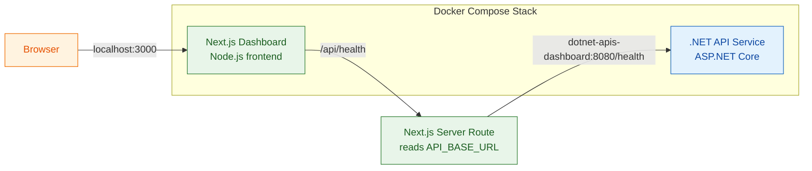

# _TheApplication

A lightweight technology workspace that combines a Next.js dashboard with a .NET API service, orchestrated through Docker Compose.

## Architecture



## Run locally

```bash
docker compose up --build
docker compose down
```

Access the apps at:
- Dashboard: `http://localhost:3000`
- API: `http://localhost:8080`

## Projects

### 1) Next.js Dashboard
- Build local and docker
  [](https://github.com/vermavarun/_TheApplication/actions/workflows/nextjs-dashboard.yaml)

### 2) .NET APIs
- Build local and docker
  [](https://github.com/vermavarun/_TheApplication/actions/workflows/dotnet-apis-dashboard.yaml)