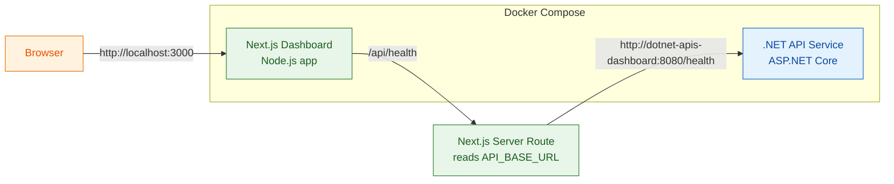

This Repository will have everything related to technology
---




0) To Run application

```
docker compose up --build
docker compose down --build
```
---

1) NextJs Dashboard
- Build local and docker [](https://github.com/vermavarun/_TheApplication/actions/workflows/nextjs-dashboard.yaml)

---

2) dotnet APIs
- Build local and docker [](https://github.com/vermavarun/_TheApplication/actions/workflows/dotnet-apis-dashboard.yaml)