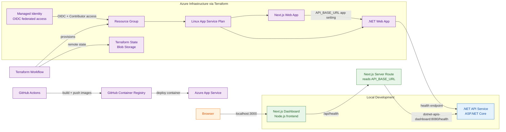

# _TheApplication

A lightweight technology workspace that combines a Next.js dashboard with a .NET API service, orchestrated locally through Docker Compose and deployed to Azure through GitHub Actions and Terraform.

## Architecture



## Run locally

```bash
docker compose up --build
docker compose down
```

Access the apps at:
- Dashboard: `http://localhost:3000`
- API: `http://localhost:8080`

## Azure deployment with Terraform and GitHub Actions

This repository also includes a Terraform configuration for provisioning the Azure infrastructure that hosts both applications.

### Infrastructure provisioned
- Shared Azure Linux App Service Plan
- Azure Linux Web App for the Next.js dashboard
- Azure Linux Web App for the .NET API backend
- Remote Terraform state stored in Azure Storage

### Terraform workflow prerequisites
Before running the Terraform workflow, the following Azure prerequisites must already exist:
- A target Azure resource group
- A managed identity configured for GitHub OIDC federation
- Contributor access for that managed identity on the target resource group
- A storage account with a blob container named `tfstate`

### GitHub workflow and deployment model
- The Next.js workflow builds the app, pushes the container image to GHCR, and deploys it to Azure Web Apps.
- The .NET workflow follows the same build-and-push pattern, then deploys the backend container image to Azure.
- The Terraform workflow uses GitHub OIDC authentication and remote state configuration to provision and manage the Azure app infrastructure.

## Projects

### 1) Next.js Dashboard
- Build local and docker
  [](https://github.com/vermavarun/_TheApplication/actions/workflows/nextjs-dashboard.yaml)

### 2) .NET APIs
- Build local and docker
  [](https://github.com/vermavarun/_TheApplication/actions/workflows/dotnet-apis-dashboard.yaml)

### 3) Terraform Azure Infrastructure
- Provision Azure infrastructure and remote state
  [](https://github.com/vermavarun/_TheApplication/actions/workflows/terraform-dashboard.yaml)