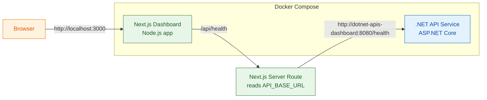

# Architecture Diagram

## Flow

1. The user opens the dashboard on port `3000`.
2. The Next.js page is served by the dashboard container.
3. The Next.js server-side health endpoint proxies the status request to the .NET API service.
4. The .NET API responds on port `8080` with the health result.
