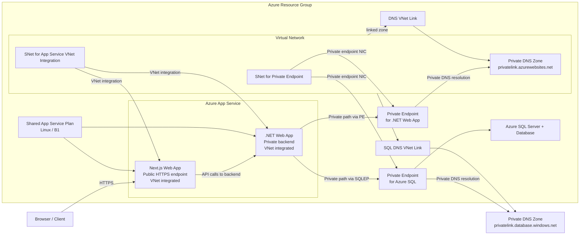

# Terraform Dashboard Infrastructure

This folder is used to deploy the Azure infrastructure for the Next.js dashboard, the .NET API dashboard, and Azure SQL Database.

## What it deploys

- A shared Azure Linux App Service plan for both dashboard apps
- A Linux Web App for the Next.js frontend
- A Linux Web App for the .NET API backend
- A virtual network for private integration
- A delegated subnet for App Service VNet integration shared by both dashboard apps
- A dedicated subnet for the private endpoint NIC
- An Azure private endpoint for the .NET app's `sites` subresource
- A private DNS zone for `privatelink.azurewebsites.net`
- A VNet link that attaches the private DNS zone to the VNet
- An Azure SQL logical server and SQL database
- An Azure private endpoint for Azure SQL in the existing private endpoint subnet
- A private DNS zone for `privatelink.database.windows.net`
- A VNet link that attaches the SQL private DNS zone to the same existing VNet

## Architecture

### Connection flow

- The Next.js dashboard is deployed to a shared Linux App Service plan and is reachable over HTTPS.
- The .NET dashboard is also hosted in the same App Service plan.
- Both dashboard apps are now attached to the same VNet through `virtual_network_subnet_id`, which enables VNet integration for outbound traffic.
- The .NET app is exposed privately through a private endpoint in a dedicated subnet that connects to the app's `sites` subresource.
- Azure SQL is deployed with public network access disabled and exposed privately through a private endpoint in the same existing private endpoint subnet.
- The private DNS zone `privatelink.azurewebsites.net` is linked to the VNet so the backend hostname can resolve privately inside the network.
- The private DNS zone `privatelink.database.windows.net` is linked to the same VNet so SQL resolves privately from the VNet-integrated apps.
- The frontend can call the backend using the backend's App Service hostname, which is resolved privately through the private DNS setup.
- The .NET app connects to Azure SQL by using the SQL private endpoint and private DNS over the existing VNet.

## Prerequisites

Before running the deployment workflow, the following Azure resources must exist:

- An Azure resource group for the deployment target
- A managed identity configured for federated access to this GitHub repository
- Contributor access on the target resource group for that managed identity
- A storage account with a blob container named `tfstate` to store the Terraform remote state

## GitHub Actions variables and secrets

The workflow expects the following repository variables and secrets to be configured.

| Type | Name | Purpose |
| --- | --- | --- |
| Variable | `RESOURCE_GROUP_NAME` | Azure resource group name used for deployment |
| Variable | `AZURE_LOCATION` | Azure region for the resources |
| Variable | `NEXTJS_DASHBOARD_WEB_APP_NAME` | Name of the Azure Web App for the Next.js dashboard |
| Variable | `DOTNET_DASHBOARD_WEB_APP_NAME` | Name of the Azure Web App for the .NET dashboard |
| Variable | `AZURE_SERVICE_PLAN_NAME` | Name of the shared Azure App Service plan |
| Variable | `SQL_SERVER_NAME` | Name of the Azure SQL logical server |
| Variable | `SQL_DATABASE_NAME` | Name of the Azure SQL database |
| Variable | `SQL_ADMIN_LOGIN` | Admin login name for the Azure SQL logical server |
| Variable | `TF_STATE_RESOURCE_GROUP` | Resource group that contains the Terraform remote state storage |
| Variable | `TF_STATE_STORAGE_ACCOUNT` | Storage account name for the Terraform remote state |
| Variable | `TF_STATE_CONTAINER` | Blob container name inside the storage account |
| Variable | `TF_STATE_KEY` | State file name to store in the container |
| Secret | `SQL_ADMIN_PASSWORD` | Admin password for the Azure SQL logical server |
| Secret | `AZURE_CLIENT_ID` | Azure app registration / workload identity client ID |
| Secret | `AZURE_TENANT_ID` | Azure tenant ID |
| Secret | `AZURE_SUBSCRIPTION_ID` | Azure subscription ID |
